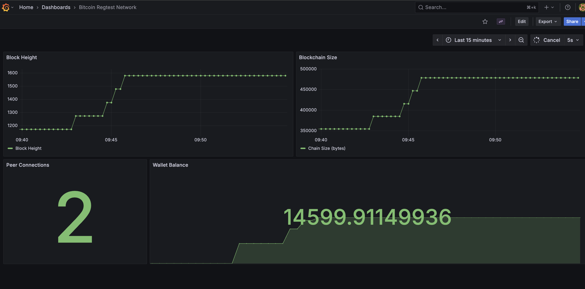

# Bitcoin Regtest Network

A Docker-based private Bitcoin network (regtest mode) setup with two nodes that can mine blocks and send transactions between each other.

## Overview

This project provides a simple way to set up and run a private Bitcoin test network using Docker. It includes:
- Two Bitcoin Core nodes running in regtest mode
- Automated node connection and synchronization
- Block mining capabilities
- Transaction creation and broadcasting between nodes
- Reusable script that can create new transactions on each run
- **Observability stack** (Prometheus + Grafana) with custom metrics exporter

## Requirements

- Docker and Docker Compose installed
- Bash shell
- Internet connection (for downloading Docker images)

## Quick Start

1. Clone the repository:
```bash
git clone <repository-url>
cd bitcoin-regtest-network
```

2. Run the script:
```bash
./scripts/bitcoin-regtest.sh
```

The script will:
- Start two Bitcoin nodes in Docker containers
- Connect them to form a network
- Mine initial blocks to fund wallets
- Create and broadcast a transaction from node1 to node2
- Mine a confirmation block

## Project Structure

```
bitcoin-regtest-network/
├── docker-compose.yml              # Docker Compose configuration for 2 Bitcoin nodes
├── scripts/                        # Shell scripts
│   ├── bitcoin-regtest.sh          # Main script to run the network
│   ├── cleanup.sh                  # Clean up containers and volumes
│   └── start-with-monitoring.sh    # Start network + observability stack
├── observability/                  # Observability and monitoring stack
│   ├── docker-compose-observability.yml  # Docker Compose for monitoring services
│   └── monitoring/                 # Monitoring components
│       ├── metrics-exporter.py     # Custom Prometheus exporter
│       ├── Dockerfile              # Exporter Docker image
│       ├── prometheus.yml          # Prometheus configuration
│       ├── grafana-datasources.yml # Grafana data source configuration
│       ├── grafana-dashboards/     # Grafana dashboard definitions
│       └── bitcoin-dashboard.json  # Bitcoin metrics dashboard
├── README.md                       # This file
├── observability/
│   └── OBSERVABILITY.md            # Observability setup guide
├── FEATURES.md                     # Project features documentation
└── .github/
    └── workflows/
        └── ci-cd.yml               # GitHub Actions CI/CD pipeline
```

## Detailed Usage

### Running the Network

The main script `scripts/bitcoin-regtest.sh` handles the complete setup:

```bash
./scripts/bitcoin-regtest.sh
```

On first run, it will:
1. Start two Bitcoin Core containers
2. Wait for nodes to be ready
3. Connect the nodes
4. Create wallets
5. Mine 101 initial blocks to fund the wallet (Bitcoin requires 100 confirmations before coinbase transactions can be spent, so 101 blocks ensures the first block's reward is spendable)
6. Send a transaction from node1 to node2
7. Mine a confirmation block

On subsequent runs, it will:
- Reuse existing containers if they're running
- Check and maintain sufficient balance
- Create a new transaction with a random amount each time
- Mine confirmation blocks

### Stopping the Network

To stop and remove all containers and volumes, you can use either method:

```bash
# Option 1: Use the cleanup script
./scripts/cleanup.sh

# Option 2: Use docker compose directly
docker compose -f docker-compose.yml down -v
```

This will completely clean up the network and all blockchain data.

### Interacting with Nodes Manually

You can interact with the nodes directly using `bitcoin-cli`:

**Node 1:**
```bash
docker exec bitcoin-node1 bitcoin-cli -regtest -rpcuser=btcuser -rpcpassword=btcpass <command>
```

**Node 2:**
```bash
docker exec bitcoin-node2 bitcoin-cli -regtest -rpcport=18445 -rpcuser=btcuser -rpcpassword=btcpass <command>
```

### Examples

#### Check Blockchain Info
```bash
docker exec bitcoin-node1 bitcoin-cli -regtest -rpcuser=btcuser -rpcpassword=btcpass getblockchaininfo
```

#### Get Wallet Balance
```bash
docker exec bitcoin-node1 bitcoin-cli -regtest -rpcuser=btcuser -rpcpassword=btcpass getbalance
docker exec bitcoin-node2 bitcoin-cli -regtest -rpcport=18445 -rpcuser=btcuser -rpcpassword=btcpass getbalance
```

#### Mine Blocks
```bash
# Mine 5 blocks on node1
docker exec bitcoin-node1 bitcoin-cli -regtest -rpcuser=btcuser -rpcpassword=btcpass generatetoaddress 5 $(docker exec bitcoin-node1 bitcoin-cli -regtest -rpcuser=btcuser -rpcpassword=btcpass getnewaddress)
```

#### Send a Transaction
```bash
# Get receiving address from node2
RECEIVE_ADDR=$(docker exec bitcoin-node2 bitcoin-cli -regtest -rpcuser=btcuser -rpcpassword=btcpass getnewaddress)

# Send 1.5 BTC from node1 to node2
TXID=$(docker exec bitcoin-node1 bitcoin-cli -regtest -rpcuser=btcuser -rpcpassword=btcpass sendtoaddress $RECEIVE_ADDR 1.5)

echo "Transaction ID: $TXID"
```

#### View Transaction Details
```bash
docker exec bitcoin-node1 bitcoin-cli -regtest -rpcuser=btcuser -rpcpassword=btcpass gettransaction $TXID
```

#### Get Block Count
```bash
docker exec bitcoin-node1 bitcoin-cli -regtest -rpcuser=btcuser -rpcpassword=btcpass getblockcount
```

## Task Examples

### Mining Blocks

The script automatically mines blocks, but you can also mine manually:

```bash
# Mine 10 blocks and send rewards to a new address on node1
docker exec bitcoin-node1 bitcoin-cli -regtest -rpcuser=btcuser -rpcpassword=btcpass generatetoaddress 10 $(docker exec bitcoin-node1 bitcoin-cli -regtest -rpcuser=btcuser -rpcpassword=btcpass getnewaddress)
```

In regtest mode, blocks are generated instantly (no proof-of-work required).

### Sending a Transaction

The script automatically sends a transaction each time it runs. You can also send transactions manually:

```bash
# Step 1: Get receiving address from node2
NODE2_ADDR=$(docker exec bitcoin-node2 bitcoin-cli -regtest -rpcport=18445 -rpcuser=btcuser -rpcpassword=btcpass getnewaddress)

# Step 2: Send BTC from node1 to node2
TXID=$(docker exec bitcoin-node1 bitcoin-cli -regtest -rpcuser=btcuser -rpcpassword=btcpass sendtoaddress $NODE2_ADDR 2.5)

# Step 3: Mine a block to confirm the transaction
docker exec bitcoin-node1 bitcoin-cli -regtest -rpcuser=btcuser -rpcpassword=btcpass generatetoaddress 1 $(docker exec bitcoin-node1 bitcoin-cli -regtest -rpcuser=btcuser -rpcpassword=btcpass getnewaddress)

# Step 4: Verify transaction
docker exec bitcoin-node2 bitcoin-cli -regtest -rpcport=18445 -rpcuser=btcuser -rpcpassword=btcpass gettransaction $TXID
```

### Creating Multiple Transactions

Run the script multiple times to create multiple transactions:

```bash
./scripts/bitcoin-regtest.sh  # Creates transaction #1
./scripts/bitcoin-regtest.sh  # Creates transaction #2
./scripts/bitcoin-regtest.sh  # Creates transaction #3
```

Each run will create a new transaction with a random amount between 0.1 and 5.0 BTC.

## Architecture

### Docker Setup

- **bitcoin-node1**: First Bitcoin node
  - RPC port: 18443
  - P2P port: 18444
  - Wallet: wallet1

- **bitcoin-node2**: Second Bitcoin node
  - RPC port: 18445
  - P2P port: 18446
  - Wallet: wallet2

Both nodes run in the same Docker network (`bitcoin-network`) and are configured with:
- Regtest mode (private test network)
- RPC authentication (btcuser/btcpass)
- Transaction index enabled
- Minimal fallback fee

### Node Connection

Nodes connect using Docker's internal networking. The script discovers each node's IP address and uses `addnode` or `connectnode` RPC calls to establish the peer connection.

## Tradeoffs and Design Decisions

1. **Docker Compose vs Manual Docker Commands**: Used Docker Compose for simplicity and reproducibility. Tradeoff: less control over individual container parameters, but easier to manage and understand.

2. **Fixed RPC Credentials**: Used hardcoded credentials (btcuser/btcpass) for simplicity. In production, these should be environment variables or secrets. Tradeoff: less secure but simpler for local development.

3. **Random Transaction Amounts**: Each script run creates a transaction with a random amount. Tradeoff: more realistic testing but less predictable for specific test scenarios.

4. **Block Generation Strategy**: Mines 101 blocks initially to unlock block rewards. Bitcoin requires 100 confirmations before coinbase transactions (block rewards) can be spent. Mining 101 blocks ensures the first block's reward has 100 confirmations and is immediately spendable. Tradeoff: takes slightly longer on first run but ensures proper funding and allows transactions right away.

## Troubleshooting

### Nodes won't connect

If nodes fail to connect, check:
```bash
docker exec bitcoin-node1 bitcoin-cli -regtest -rpcuser=btcuser -rpcpassword=btcpass getpeerinfo
docker exec bitcoin-node2 bitcoin-cli -regtest -rpcuser=btcuser -rpcpassword=btcpass getpeerinfo
```

### Port conflicts

If ports 18443-18446 are already in use, modify the port mappings in `docker-compose.yml`.

### Insufficient funds

If you get "insufficient funds" errors, mine more blocks:
```bash
docker exec bitcoin-node1 bitcoin-cli -regtest -rpcuser=btcuser -rpcpassword=btcpass generatetoaddress 50 $(docker exec bitcoin-node1 bitcoin-cli -regtest -rpcuser=btcuser -rpcpassword=btcpass getnewaddress)
```

### Containers won't start

Check Docker logs:
```bash
docker-compose logs bitcoin-node1
docker-compose logs bitcoin-node2
```

## Observability

Want to monitor your Bitcoin network in real-time? Check out the **full observability stack**:

```bash
./scripts/start-with-monitoring.sh
```

This starts Prometheus, Grafana, and a custom metrics exporter that exposes:
- Block height and blockchain growth
- Peer connections
- Wallet balances
- And more...

See [observability/OBSERVABILITY.md](observability/OBSERVABILITY.md) for details.

**Access:**
- Grafana: http://localhost:3000 (admin/admin)
- Prometheus: http://localhost:9090

## CI/CD

This project includes GitHub Actions workflows for automated testing and validation:

### Continuous Integration (CI)
- Validates bash scripts and Docker configurations on every push/PR
- Runs ShellCheck linting
- Tests Docker Compose file syntax

### Continuous Testing (CT)
The pipeline runs three parallel test suites on each commit:

1. **Basic Network Test**: Validates Bitcoin node startup, connectivity, and basic transaction creation
2. **Full Network Test**: Tests transaction reusability by creating multiple transactions sequentially
3. **Observability Test**: Verifies the Prometheus + Grafana monitoring stack is working correctly

**Note**: The GitHub Actions environment is ephemeral - runners are destroyed after each workflow completes. The CI pipeline validates that everything works correctly but doesn't maintain a persistent deployment. For production deployments, you would need to deploy to a permanent environment (cloud VM, Kubernetes cluster, etc.).

See `.github/workflows/ci-cd.yml` for the complete pipeline configuration.

## Future Enhancements

### Observability and Logging

While not required for the core functionality, this project includes a comprehensive observability stack demonstrating production-ready monitoring capabilities. Future enhancements could include:

#### Log Aggregation
- **Application Logs**: Transaction details, wallet balances, and node events can be forwarded to centralized logging solutions:
  - **ELK Stack** (Elasticsearch, Logstash, Kibana) for log aggregation and analysis
  - **Kibana** for advanced log visualization and dashboards
  - Structured logging with JSON format for better parsing and filtering

#### Advanced Observability
- **Distributed Tracing**: Integrate with **Jaeger** for transaction flow tracing across nodes
- **Alternative Monitoring Stacks**:
  - **Datadog** for comprehensive APM (Application Performance Monitoring)
  - Enhanced **Prometheus + Grafana** setup with custom alerts and SLAs
  - **OpenTelemetry** for vendor-neutral observability

#### Current Implementation

The project already includes a working Prometheus + Grafana observability stack with custom metrics:



*The dashboard above (not a requirement, but implemented to demonstrate going above and beyond) shows real-time monitoring of:*
- Block height and blockchain growth
- Blockchain size metrics
- Peer connection status
- Wallet balance tracking

See [observability/OBSERVABILITY.md](observability/OBSERVABILITY.md) for setup instructions.
